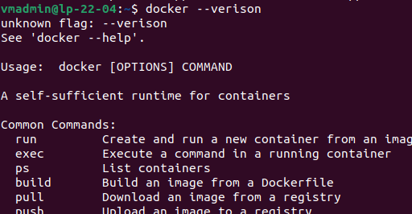
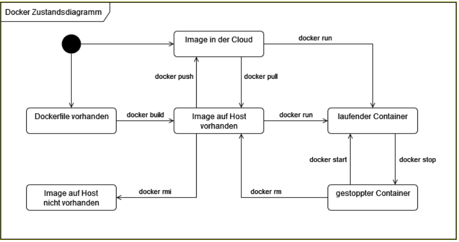

# Dokumentation Modul 347

## Einleitung

Diese Dokumentation dient dazu, den fortlaufenden Ablauf des Unterrichts festzuhalten und für persönliche Referenzzwecke zu nutzen.

### Grundlagen
#### Container Grundlagen 
* **Welche Problematik löst Docker?**

Containerisierung: Docker ermöglicht es Entwicklern, eine Anwendung mit all ihren Teilen (wie Bibliotheken und anderen Abhängigkeiten) als Paket zu verpacken und dann auszuliefern. Diese Container sind universell auf verschiedenen Hosts einsatzfähig und bieten praktische Kapselung, Isolierung und Portabilität von Anwendungen.


Das man die Applikation an andere Entwickler rüberschicken kann, damit diese problemlos auf ihnen laufen und das die Ressourcen in die richtige Version mitgeliefert werden .


* **Worin liegt der Unterschied zwischen einer VM und einem Container?**
  
Der grösste Unterschied liegt darin das sich eine VM zusätzlich um die Betriebssysteme kümmern muss
währendessen Container ohne Betriebsysteme laufen, welche zu einem niedrigeren Ressourcenverbrauch führt.

* **Erklären Sie die Begriffe «Docker Image», «Dockerfile», «Docker Container» und «Docker Registry».?**
  
***Docker Image***: Ein ausführbares Paket von Software, das alle benötigten Komponenten enthält, um eine Anwendung auszuführen. Es ist eine Vorlage für Container.

***Dockerfile***: Eine Textdatei mit Anweisungen zum Erstellen eines Docker Images. Es beschreibt den Aufbau des Containers.

***Docker Container***: Eine standardisierte Softwareeinheit, die Code und Abhängigkeiten zusammenfasst. Container sind leichtgewichtig, portabel und sicher.

***Docker Registry***: Ein Dienst zum Speichern und Verteilen von Container-Images und Artefakten, z. B. Docker Hub.

* **Unterschied Image & Containers**

> "Der Image dient dazu als Vorlage für den Container, welcher dann von der Vorlage lebt also ableitet."

#### Docker Installation

1. Überprüfen Sie das korrekte Funktioineren mit dem hello-world Image
   


2. Ermitteln Sie die installierte Version von Docker
   


3. Welche Container laufen auf der virtuellen Maschine
   


4. Welche Images findes Sie auf der Maschine
   


### Container ausführen

#### Komandos

* **Laden Sie das Image für den Apache Webserver (httpd:latest) herunter und starten Sie daraus einen 
Container mit dem Kommando: **

``` docker linenums="1"
docker run -d --name my-apache-webserver -p 8080:80 httpd:latest

```
(-p 8080:80 bewirkt, dass der Server von localhost aus auf Port 8080 erreichbar ist)
 
* ** Überzeugen Sie sich davon, dass der Container läuft**
  


* **Starten Sie eine interaktive bash-Sitzung (-it) im Container und finden Sie heraus, wo sich die 
angezeigte Seite index.html im Container befindet. Die Sitzung können Sie mit *exit* wieder verlassen**

```
docker exec -it my-apache-webserver /bin/bash

----> /usr/local/apache2/htdocs
```

* **Starten Sie aus dem Image httpd:latest einen zweiten Container auf Port 8081**
```
docker run -d --name my-apache2-webserver -p 8081:80 httpd:latest
```

* **Lassen Sie sich die laufenden Container anzeigen & alle *Gestarteten & Gestoppten* **

```
docker ps -a
```

* ** Alle Images anzeigen lassen **

```
docker images
```

* **Container stoppen**

```
docker stop {NameDesContainer}
```

* **Container starten**

```
docker start {NameDesContainer}
```

* **Alle Container löschen ! *Mann muss alle Container zuerst stoppen damit man sie löschen kann*** 

```
docker rm -f $(docker ps -aq)
```

* **Alle Images löschen**

```
docker rmi -f $(docker images -q)
```

##### Zustandsdiagramm
